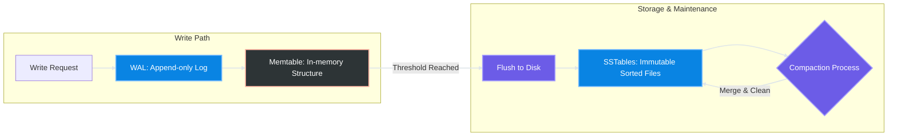
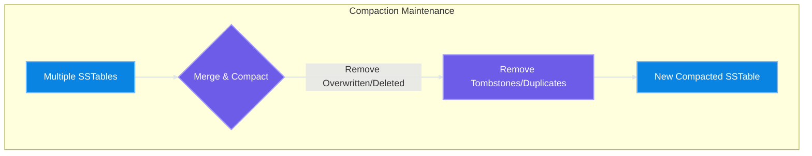

# Log Structured Merge Tree (LSM Tree)

Implementation notes for a **Log Structured Merge Tree (LSM Tree)** in Go.

An LSM Tree is a storage architecture optimized for **high write throughput**.  
Instead of performing random updates on disk, writes are first buffered in memory and later flushed to disk as **sequential files**.

This approach converts **random disk writes into sequential writes**, which significantly improves write performance.

Many modern databases use LSM Trees, such as:

- RocksDB
- LevelDB
- Cassandra
- ScyllaDB

---

## Components

### 1. WAL (Write-Ahead Log)

An **append-only log** used for durability.

Every write is first appended to the WAL before being inserted into the memtable.

Purpose:

- crash recovery
- durability guarantee

---

### 2. Memtable

An **in-memory sorted data structure** (often implemented using B-Tree or Skiplist).

Responsibilities:

- buffer writes in memory
- maintain sorted order of keys

Once the memtable reaches a threshold, it is **flushed to disk**.

---

### 3. SSTable (Sorted String Table)

An **immutable sorted file** stored on disk.

Properties:

- keys are sorted
- written sequentially
- never modified after creation

Reads may require checking multiple SSTables.

---

### 4. Compaction

Since updates create multiple versions of keys, background **compaction** merges SSTables and removes stale entries.

Compaction:

- merges sorted files
- removes outdated values
- reduces storage amplification

---

# Why LSM Tree?

Traditional databases using B-Tree indexes perform **random disk writes** when updating pages.

LSM Trees trade **CPU and memory usage** for **sequential disk writes**, which are much faster.

---

# How LSM Tree Works

## 1. Write flow



SStable Layout

```text
|-------------------------------------|
| keySize | valueSize | key | value   |
| keySize | valueSize | key | value   |
| keySize | valueSize | key | value   |
|-------------------------------------|
| keySize | key  | offset (sparse idx)|
| keySize | key  | offset             |
|-------------------------------------|
| indexStartOffset (8 bytes footer)   |
|-------------------------------------|
```

Index Entry format:

```text
| keySize (8 bytes) | key (variable) | offset (8 bytes) |
```

## 2. Read flow


## 3. Compaction flow



---

# Trade-offs

## Pros

- Very high **write throughput**
- Sequential disk writes
- Good for **write-heavy workloads**
- Scales well for large datasets

## Cons

- **Read amplification** (may need to check multiple SSTables)
- **Write amplification** due to compaction
- **Space amplification** before compaction runs
- Range queries can be slower without additional indexing

---

# Use Cases

LSM Trees are commonly used in:

- key-value stores
- time-series databases
- log ingestion systems
- write-heavy distributed databases

---

# References

- The Log-Structured Merge-Tree (LSM-Tree) Paper
- Designing Data-Intensive Applications
- RocksDB Architecture
